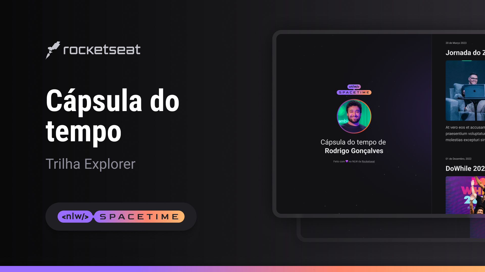

  

## 💡 Projeto

Esse é um projeto Web Responsivo de uma cápsula do tempo para exibir uma timeline de memórias.

## 🖥️ Tecnologias

Esse projeto foi desenvolvido duranto o NLW - Spacetime da Rocketseat com as seguintes tecnologias:

- HTML
- CSS
- GIT e GitHub

## 📌 Layout

Você pode visualizar o layout do projeto através
[desse link](<https://www.figma.com/file/CrLx2I2afe1xir8EPjDeRM/C%C3%A1psula-do-tempo-%E2%80%A2-Trilha-Explorer-(Community)?type=design&node-id=306%3A3&t=uOQ6LxxJbIF0viz8-1>).
É necessário ter uma conta no [Figma](https://www.figma.com)
